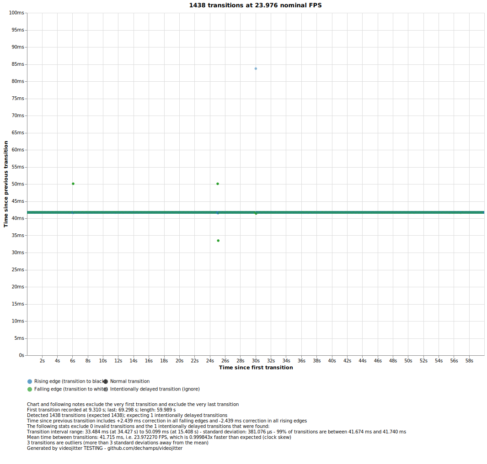

# videojitter examples gallery

This page shows some videojitter measurements of real-world systems and a
discussion of the various phenomena they surface. It can be seen as a showcase
of what videojitter is capable of, or as a guide on how to interpret the various
patterns that sometimes appear in practical measurements.

All measurements shown here have been made using a cheap homemade instrument,
specifically a Panasonic AMS3 light sensor feeding an ASUS Xonar U3 used as an
ADC. You can [build a similar instrument for yourself][] in minutes.

## Perfect result

This result, obtained by playing a 120/1.001 FPS video on the built-in player of
an LG G1 OLED TV, it the best result a videojitter user could possibly hope for.

The frame transitions form an extremely clear, sharp, straight horizontal line
on the chart with no deviations whatsoever, except for the intentionally delayed
transition (as expected). This means the time interval between frames (8.34 ms,
as expected for 120/1.001 FPS) stayed exactly the same throughout the entire
test signal with no outliers - no late nor early frames.

This example also demonstrates the ability of both the playback and measurement
system to handle very high FPS - much higher than typical video content - as
well as their amazing timing accuracy, which as described in the "fine print"
(the text below the chart) is in the order of 10 µs (yes, *micro*seconds).

If you get this kind of result, your playback system is basically flawless as
far as frame presentation timing is concerned.

## Isolated timing errors

This result was obtained by playing a 24/1.001 FPS video (typical of most movie
content) using the [madVR][] software video player running on a Windows 11 PC.
The display device is the same as the previous example and is being driven at a
120/1.001 Hz refresh rate.

Compared to the perfect example above, we can spot a couple of differences.

The line is higher, which simply reflects the slower frame rate (longer
transitions between frames). It's worth noting that, even though the display is
running at 120 Hz, the test video is running at 24 FPS, so that's what
videojitter sees - obviously it cannot observe individual display refreshes if
the frame does not change.

More importantly, one immediately spots a few _unexpected_ outliers on the chart
(the intentionally delayed transition is also an outlier, but it's expected).
This means there are transitions that did not happen after the expected 41.71 ms
since the previous one: the frame was presented either too early (below the
line) or too late (above the line).

This is a typical result when playing videos using PC software players, which
suffer from a number of technical challenges that make it difficult for the
player to perfectly time frame presentation.

In this particular case, the delayed transition at about 6 seconds into the
recording was likely caused by the video output clock running too fast relative
to the playback clock, forcing the system to delay a frame to compensate.

The second pair of late and early transitions at about 25 seconds was likely
caused by the playback system "missing a beat" on a single frame (possibly due
to a thread scheduling deadline miss), and then showing a later frame earlier to
"catch up".

It's also worth noting the amount of time by which the transition interval
deviated on these early and late frames. It turns out that every one of these
outliers deviated by ±8.34 milliseconds. This is completely unsurprising given
the display refresh interval in this example was 120/1.001 Hz - the frame was
simply displayed one refresh interval too early or too late, as one would
naturally expect.

## Systematic timing errors

The above result was obtained by playing a 24/1.001 FPS video on the built-in
player of an LG G1 OLED TV.

Just like the previous example we observe timing errors, but this time they are
not isolated. The typical error is ±8.3 ms, which suggests that the TV is
running at 120 Hz internally. The built-in video player seems unable to reliably
meet individual refresh targets and is constantly "missing the mark". This is a
surprisingly poor result for a built-in hardware video player.

While it may look like the errors follow a precise periodic pattern, this is not
quite the case - if we zoom in we see the behavior is not exactly the same each
time:

## Periodic timing errors

The above result was obtained by playing a 24/1.001 FPS video on the built-in
"Nebula HDR" display of an ASUS ROG Flow X16 2023 laptop using Windows Media
Player on Windows 11. The display is being driven at 240 Hz.

Aside from a couple of outliers near the 11-second mark, what is interesting in
this example is a seemingly periodic pattern of delayed frames. Each frame is
delayed by exactly one refresh interval, which at 240 Hz is ~4.2 ms.

This phenomenon can be explained by the display refresh rate (240 Hz) not being
a perfect whole multiple of the video FPS (24/1.001 FPS). Most of the time each
frame is displayed for exactly 10 refresh intervals, which is ~41.666666 ms, but
that's slightly wrong. In a 24/1.001 FPS video, each frame should be displayed
for slightly longer: ~41.708333 ms. As a result, an absolute, constant timing
error of ~0.041666 ms accumulates with each new frame. This goes on until the
error reaches the duration of a whole refresh interval (~4.16666) ms), which
happens after exactly 100 frames or ~4.2 seconds. At that point, the system
delays the next frame by one refresh interval so that the playback clock can
"catch up" to the excessively fast display refresh clock. If this hypothesis is
correct, we should expect to see a transition delayed by ~4.2 ms every ~4.2
seconds… and that is exactly what we see here!

This example also demonstrates that you don't need a fast instrument to
accurately measure high refresh rate displays: here the display refresh interval
is ~4.2 ms, but it was measured using an instrument that takes ~8.5 ms to
settle. Even then, the instrument was still able to very precisely measure the
timing errors shown above. This is because what really matters is not display
refresh rate, but the frame rate of the test video. In this example the test
video is 24/1.001 FPS which is well within the limits of the instrument.

## 3:2 "23p@60Hz" pattern

The above is a textbook example of a 24 FPS test video being played on a display
being driven at a 60 Hz refresh rate, leading to the infamous "3:2 pattern"
which is very commonplace when playing video on PC.

Basically, the problem is that 60 is not a whole multiple of 24, so the only way
for the video player to make that work is to display a frame for 2 refresh
intervals (2/60), then 3 refresh intervals (3/60), then 2, then 3, etc. This
leads to the correct _average_ overall frame duration of 5/120 or 1/24 so the
video can play at the proper speed, but at the cost of a very significant timing
error on each frame.

On a videojitter chart, this takes the form of a very obvious pattern where the
frame transition intervals arrange themselves into two clear "lines": one at ~3
3ms (2 60 Hz refresh intervals) and one at ~50 ms (3 60 Hz refresh intervals).

Zooming in, we can easily observe that frame durations indeed alternate between
the two from one frame to the next, as expected:

The reason why the colours swap positions in the middle of the first chart is
because of the intentionally delayed transition, which causes the pattern
between black and white frames to be inverted.

[build a similar instrument for yourself]: INSTRUMENT.md
[madVR]: https://forum.doom9.org/showthread.php?t=146228
