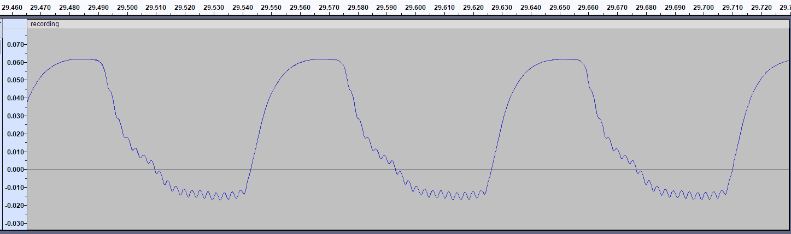

# videojitter FAQ

## Are there setups videojitter may struggle with?

Yes. In general, the following situations make the videojitter analyzer's job
harder and may lead to loss of precision or nonsensical results:

- **Light pollution** on the instrument, e.g. attempting to measure in a bright
  room.
  - This is especially problematic if the room is illuminated by a light source
    that exhibits high frequency flicker, such as some LED lamps. In such cases
    videojitter may be confused into thinking your room lights are the display
    and will end up measuring them instead!
- The [warmup/cooldown pattern][] being interpreted as part of the test signal.
  - This will usually surface as problems in the first/last few seconds of the
    recording. The test signal may also be reported as being slightly longer
    than expected (e.g. 65 seconds instead of 60).
  - This is usually caused by the instrument being too close to the display,
    such that it only sees one "square" of the checkers pattern. Move the
    instrument away from the display so that it can see multiple squares.
- Incorrect **instrument recording levels**.
  - If the recording level is set too low, [signal-to-noise ratio (SNR)][] may
    suffer.
  - If the recording level is set too high, or the instrument is saturated by
    excessive light levels, clipping may occur.
- Video playback systems that exhibit **[tearing][]** or make use of **"frame
  blending", "[motion interpolation][]"** or [similar techniques][].
  - These make it impossible to tell when original video frames begin and end,
    and will confuse videojitter.
  - In particular, when measuring TVs, double check that any "motion smoothness"
    features are disabled - they are often enabled by default.
- More generally, video playback systems that are not strictly "sample and hold"
  may confuse videojitter.
  - Examples of systems that are not "sample and hold" include "refresh type"
    displays such as **CRTs** and **plasma**, and displays that make use of
    [motion blur reduction techniques][] such as **"backlight strobing"** or
    **"black frame insertion"** (BFI).
  - Such displays may "blink" white frames multiple times, confusing videojitter
    into reporting multiple transition for a single white video frame.
- Displays that use **[PWM backlights][]** may also confuse videojitter for the
  same reason as above.
  - Most PWM backlights have high enough frequency that videojitter will be able
    to "see past" them, but that is not always the case.
  - If your display uses a PWM backlight, it's a good idea to always set the
    backlight to 100% which should hopefully defeat PWM.
  - When measuring a display that uses PWM, a "PWM edge" may occur around the
    same time as a frame transition, leading to increased variance in transition
    timestamp estimates which takes the form of visible "noise" on the resulting
    videojitter chart.
- **Time-varying display backlight intensity** may confuse videojitter and lead
  to loss of precision.
  - Examples include "**dynamic contrast**" and "**local dimming**", which lead
    to different transition shapes depending on frame duration, and can also
    make the [warmup/cooldown pattern][] less effective.
  - Another example are ambient light sensors, which are sometimes enabled by
    default on smartphones and TVs.
  - Make sure these features are disabled while recording.
- **Frames that are too short** in duration, such that the next transition
  occurs before the display and/or instrument has time to settle.
  - These make it difficult for videojitter to precisely time transitions,
    because the shape of "truncated" transitions is different from the shape of
    a "full" transition.
  - Ideally your instrument should settle faster than the frame duration you are
    trying to measure.
  - Even if your instrument is fast enough, at high enough frame rates, the
    display itself may be the bottleneck - consider that many LCD panels may
    struggle to fully transition between black and white in less than a few
    milliseconds.
  - In general, this is unlikely to be a problem when measuring 24 FPS video,
    because 24 FPS frames take an eternity as far as typical setups are
    concerned. >60 FPS video is usually where things get challenging.
  - See this [example][240hz] for a detailed discussion of how excessively slow
    transitions may look like.

In many of the cases described above, looking at the recording waveform (e.g. in
an audio editor such as Audacity) will often provide visual hints as to what the
problem may be. For example, the following waveform shows evidence of display
backlight PWM in the form of a high-frequency, low-amplitude periodic signal
superimposed on white frames only:

If you think videojitter should be able to do a better job analyzing a given
recording, feel free to [file an issue][] (include your spec and raw recording
file) so that the problem can be looked at; it may be possible to improve
videojitter to better handle certain scenarios. As a last resort, adjusting some
`videojitter-analyze-recording` options such as `--min-edge-separation-seconds`,
`--min-frequency-ratio` or `--slope-prominence-threshold` may help in some
cases, but do file a report anyway as ideally videojitter users shouldn't have
to touch these.

## What is the purpose of the "warmup" and "cooldown" patterns?

By default, videojitter test videos include a 5-second "warmup" section and a
5-second "cooldown" section before and after the test signal itself. These serve
multiple purposes:

1. To ensure the boundaries of the test signal are clear to the analyzer.
   - Otherwise the analyzer could get confused and include some random activity
     before/after the test signal in the results.
2. To provide some padding, allowing the video playback system to "settle down"
   before the actual measurement starts.
   - For example, this gives time for potential video player On-Screen Display
     (OSD) elements to fade out so that they don't interfere with the
     measurement.
   - Some video playback systems also tend to have some benign frame timing
     issues at the very beginning of playback that are not representative of
     steady state operation.
3. To ensure that the average light level right before and after the test signal
   is roughly similar to the average light level of the test signal.
   - This is achieved using a blinking checkers pattern, which ensures that
     every pixel of the display sees the same on/off cycle as during the test
     signal.
   - The use of a checkers pattern, as opposed to full screen black/white,
     results in the overall pattern looking like "grey" to the instrument,
     assuming that it is located far enough away from the display for the light
     from the checker pattern to spatially integrate in the instrument. This
     ensures the analyzer won't mistake the pattern for the test signal.
     - One alternative could be to actually display a full screen grey color,
       but this is harder than it sounds because the correct color value would
       depend on gamma and on the effective duty cycle of the test signal on/off
       light output. The checkers pattern approach is more robust, though it is
       by no means perfect (e.g. it will fail to match the response of the test
       signal if the display uses "dynamic contrast").
   - The overarching goal is to prevent large, sudden average light level shifts
     at the beginning and end of the test signal, which would otherwise result
     in measurement artefacts especially with slow display/instruments and/or
     AC-coupled instruments.

You can adjust the length of these patterns, or remove them entirely, using the
`videojitter-generate-video` `--begin-padding` and `--end-padding` options. This
is especially useful if you want to measure the very beginning of playback. Of
course, if you remove the padding, you will lose the aforementioned benefits,
but the analyzer will do its best to make sense of your recording regardless.

## What is "edge direction compensation"?

Edge direction compensation is a feature of the videojitter report generator
that is aimed at suppressing distracting timing differences between transitions
to white frames vs. transitions to black frames.

To understand why this is useful, it is important to realize that displays tend
to exhibit different response curves (as in, light signal waveforms) when
transitioning to white vs. transitioning to black. This can lead to videojitter
measuring a consistent, systematic delay depending on the color of the frame
being transitioned to.

To be clear, this is not a measurement artefact, _per se_ - after all, these
delays are, in fact, induced by the video playback system, and one could argue
they should be reported as such. (This assumes the instrument itself does not
come with its own asymmetric response. It is unclear if this assumption holds in
practice.)

However, one could just as easily argue that these delays are misleading,
because they will tend to suggest that there is systematic timing error between
adjacent pairs of frames, but in reality this timing error is completely
dependent on the source and destination color of the pixel being transitioned.
In extreme cases this can lead to reports that suggest the presence of a 3:2
"24p@60Hz" pattern that isn't real, for example.

It is important to keep in mind that videojitter's goal is to measure _when_
transitions occur and how much time elapses _between_ them, not how individual
transitions look like or how long they take. If you want to do that, you'd
likely want to research the methods display hardware reviewers use to [measure
display pixel response][]. videojitter is more suitable for diagnosing issues
upstream of the display itself, where frames are not being sent to the display
at the right time.

For these reasons, videojitter will attempt to hide delays that uniformly affect
transitions to frames of the same color. This is what "edge direction
compensation" does.

Edge direction compensation is implemented by calculating the average delay in
rising edges (transitions to a given color) and separately for falling edges
(transitions to the opposite color). videojitter then uniformly applies a timing
correction to all same-direction edges throughout the entire recording so that
the difference disappears. The amount of correction applied is indicated in the
"fine print" (the text below the chart).

Edge direction compensation can be disabled by passing the
`--no-edge-direction-compensation` option to `videojitter-generate-report`. This
will likely result in the chart showing two separate "lines" as the transition
interval changes back and forth with every frame.

## What is the purpose of the "intentionally delayed transition"?

If you look closely at the test video that videojitter generates, you will
notice that there is a single frame exactly halfway through that is repeated,
i.e. the same color is shown for two frames in a row. This is not a bug;
videojitter duplicates that frame on purpose to create an _intentionally delayed
transition_.

This is done for two reasons:

1. To determine the polarity of the recording.
   - Intuitively, you'd expect a higher light level to translate to a higher
     signal level in the recording, but that is not always the case; with some
     instruments it's the opposite.
   - For user convenience, videojitter attempts to autodetect the polarity of
     the recording. The way this works is, videojitter looks at the recording
     level for the repeated frame, and since it knows what color the repeated
     frame is, it can deduce the mapping between signal level and frame color.
   - If the autodetection succeeds, videojitter will report frame colors (i.e.
     "black" or "white"); if it fails, the chart will only show edge direction
     (i.e. "falling edge" or "rising edge").
2. To break up any patterns that affect the relative timing of successive pairs
   of transitions.
   - The textbook example is a 3:2 "24p@60Hz" pattern, where every other frame
     is displayed for a different amount of time.
   - If there was no delayed transition, the pattern would _de facto_ induce a
     systematic delay in white frames (or black frames).
   - This is a problem because it would interact badly with [edge direction
     compensation][]: indeed videojitter would be unable to tell whether the
     difference in duration between black frames and white frames is due to
     benign differences in display pixel response (which we don't care about),
     or whether it's caused by actual differences in frame presentation timing
     such as a 3:2 pattern (which we definitely do want to know about).
   - The goal of the delayed transition is to invert that relationship,
     decorrelating frame color from any frame timing pattern.

During report generation, videojitter will attempt to automatically locate the
intentionally delayed transition among the other transitions in the recording
and annotate it accordingly. Note this autodetection relies on heuristics (it's
basically looking for a transition that "stands out" from its neighbors around
the timestamp where the delayed transition is supposed to be), which means it
doesn't always work. If autodetection fails, the delayed transition will not be
annotated on the chart and frame colors won't be shown. It's also possible for
videojitter to [incorrectly locate the delayed transition][], which means the
annotation will be on the wrong transition, and the frame color information may
be inverted as well.

You can omit the delayed transition from the test video (and subsequent
analysis) by passing the `--no-delayed-transition` option to
`videojitter-generate-spec`. Note that this will prevent videojitter from
determining frame colors, and it will also disable [edge direction
compensation][] by default to avoid potentially misleading results.

## What does "clock skew" mean?

Videojitter always reports timestamps and durations based on sample time from
the recording WAV file. In other words, the reference clock is the clock of the
instrument.

No clock is ever perfect, and the clock of the instrument does not run at the
exact same speed as the clock that the video playback system uses to time
frames. Therefore, a very small deviation (<0.1%) from expected frame durations
is normal and expected. This is called _clock skew_.

Large clock skews, in the order of 1% or more, are more concerning and may be
indicative of a potential problem. For example, some video playback setups
(hopefully rare nowadays) may speed up 24 FPS content to 25 FPS, resulting in
the video playing ~1.04x faster than normal.

videojitter will automatically calculate and report clock skew in the "fine
print" (the text below the chart) so that any issues may be quantified and dealt
with.

[240hz]: EXAMPLES.md#artefacts-caused-by-overly-slow-displayinstrument
[edge direction compensation]: #what-is-edge-direction-compensation
[file an issue]: https://github.com/dechamps/videojitter/issues
[measure display pixel response]:
  https://tftcentral.co.uk/articles/response_time_testing
[motion blur reduction techniques]:
  https://tftcentral.co.uk/articles/motion_blur
[motion interpolation]: https://en.wikipedia.org/wiki/Motion_interpolation
[incorrectly locate the delayed transition]:
  EXAMPLES.md#artefacts-caused-by-overly-slow-displayinstrument
[PWM backlights]: https://tftcentral.co.uk/articles/pulse_width_modulation
[similar techniques]: https://github.com/mpv-player/mpv/wiki/Interpolation
[signal-to-noise ratio (SNR)]:
  https://en.wikipedia.org/wiki/Signal-to-noise_ratio
[tearing]: https://en.wikipedia.org/wiki/Screen_tearing
[warmup/cooldown pattern]:
  #what-is-the-purpose-of-the-warmup-and-cooldown-patterns
