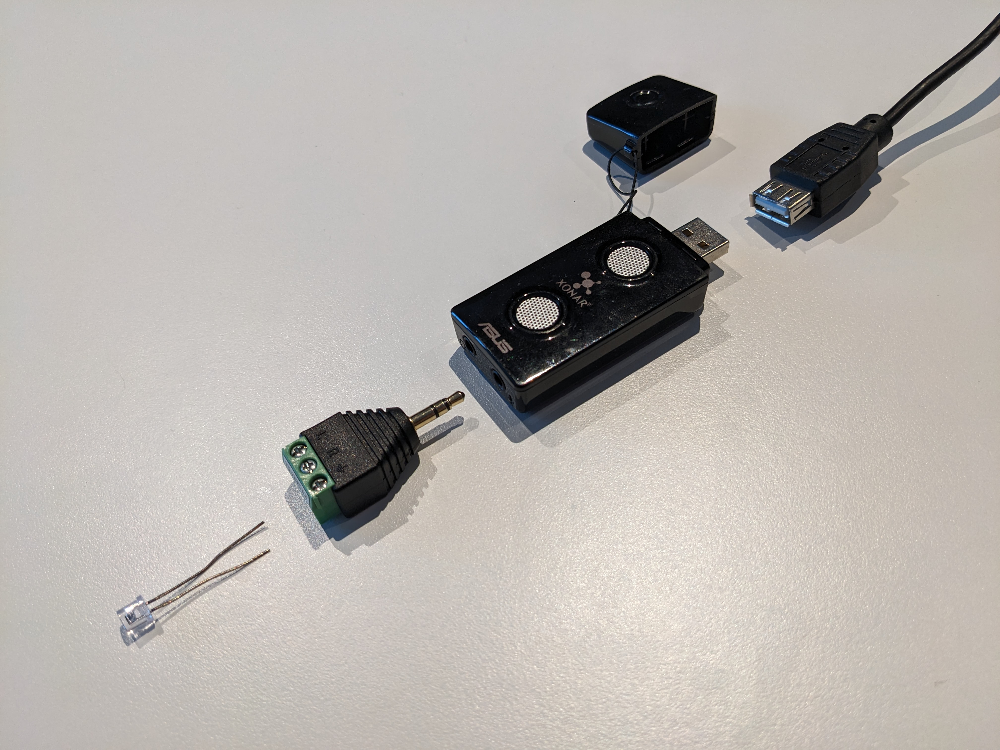
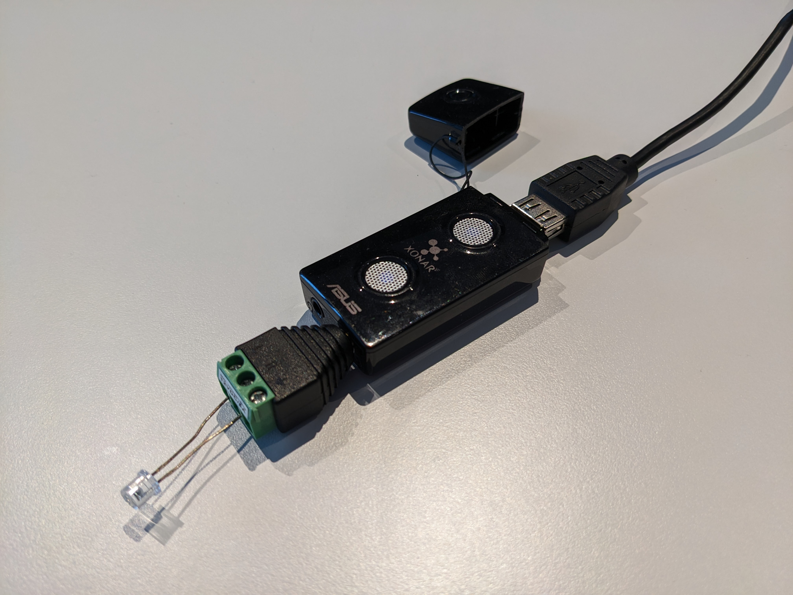
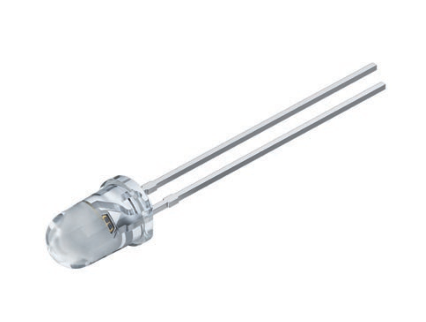
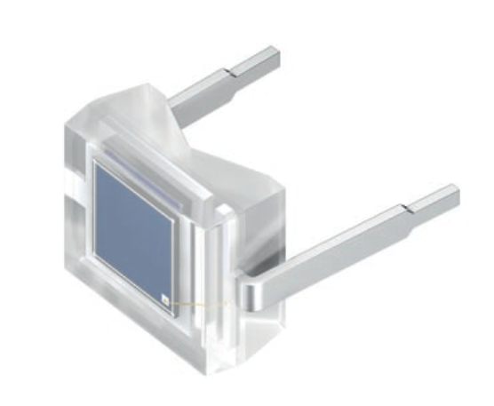
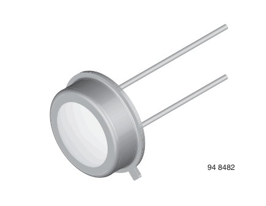
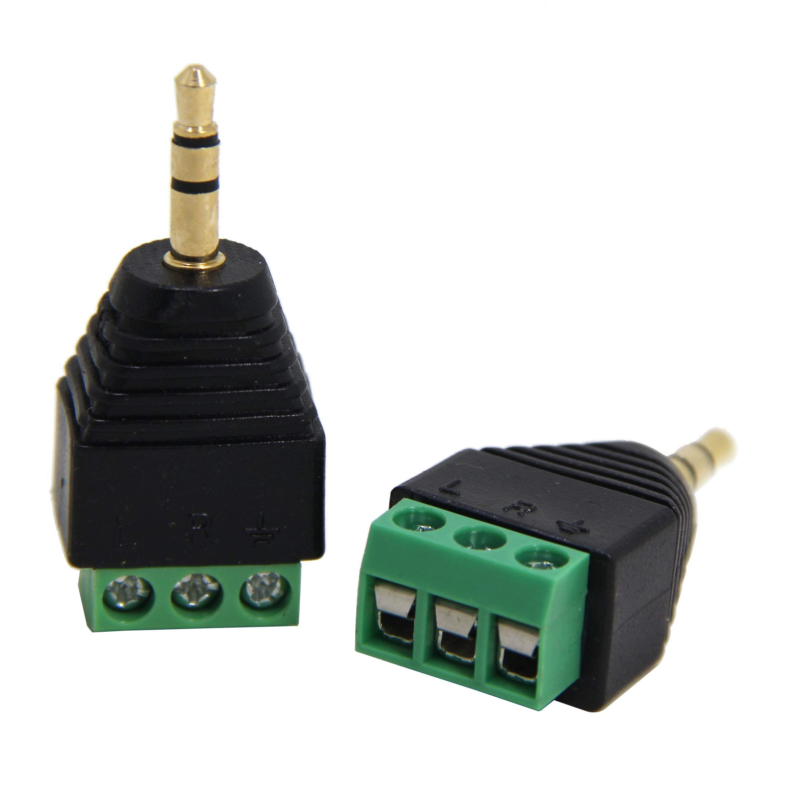
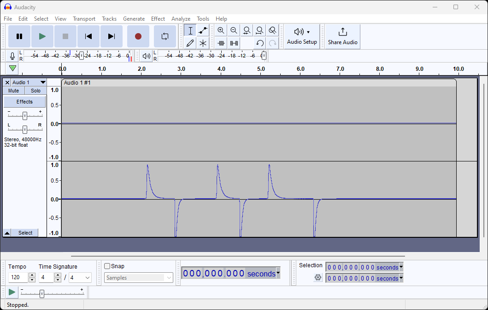
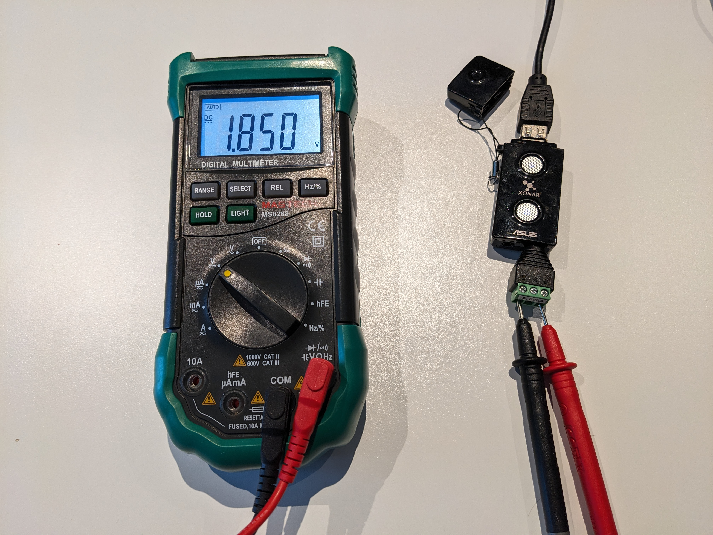

# Building a videojitter instrument on the cheap

As explained [in the README][], videojitter requires an _instrument_ to record
the physical light output of the display you are trying to measure.

You may already have hardware to do this, especially if you have access to a
lab. Basically, if you have a way to capture the output of a [sufficiently fast
and noise-free][requirements] light sensor into a WAV file, you're already good
to go and the rest of this document should be of no interest to you.

If, however, you are missing this crucial piece of equipment and are looking for
a solution, do read on…

## Building a dirt-cheap instrument in minutes

You can build an instrument by putting together the following parts:

- A suitable light sensor from an electronics store;
- The input microphone/line-in jack of an audio interface (e.g. on a computer or
  a USB audio interface);
- Some wires/adapter to make the sensor fit into the audio jack.

That's it. Really - it's as simple as that. You can get easily get away with
spending less than $30 on the above. In fact, if you already have a suitable
audio input (which is likely), you can probably get away with spending less than
half that.

As for tools, depending on the adapter you use, you may only need a
screwdriver - no soldering required.

## Hold on, how could that possibly work?

The output of a light sensor is an analog signal which can be measured by any
suitable [ADC][]. The inputs on an audio interface are ADCs, and their
characteristics (sample rate, bit depth, max input voltage) are sufficient for
our needs. Conceptually, such audio inputs are really just specialized
oscilloscopes… and the resulting signal can easily be saved into a WAV file for
videojitter to consume.

This may seem difficult to believe, but yes, it does mean that if you naively
shove a light sensor directly into an audio input, chances are it will just
work!

That said, behind the scenes there are some subtleties related to DC bias
voltage depending on the type of light sensor and ADC used. See the [appendix][]
for details. Luckily, you don't need to care about this too much as most
combinations will still work anyway.

## What about accuracy/performance?

Even bad hardware choices will likely still result in a usable instrument that
meets the [requirements][] reasonably well.

With carefully selected components (and perhaps a bit of trial and error), the
instrument can be made essentially perfect for all intents and purposes. Note
this doesn't necessarily mean a bigger budget. For example, 120 FPS measurements
with frame timestamp standard deviations as low as 10-30 µs have been achieved
with the [OSRAM SFH 213][osram-sfh213] photodiode connected to a cheap consumer
audio interface (ASUS Xonar U3). Here's how much that photodiode costs: $0.85.
No, that's not a typo. videojitter itself was developed and tested with similar
hardware.

## Okay I'm sold, what do I need to do?

### Step 1: acquire a suitable audio input

You probably already have one. Most should work in theory, although it may be a
bit hit-and-miss in practice as these devices are obviously not designed for
this use case. An an example, videojitter was developed and tested using the
ASUS Xonar U3 shown in the pictures.

Note that there may be significant differences in behavior depending on whether
the input is labeled as a "line input" or "microphone input". Indeed there are
electrical differences between the two types. That doesn't mean one is always
preferred over the other - it depends on the situation. See the [appendix][] for
details.

If you don't have a suitable input, look for an audio interface that provides
one. You can usually just search for something like "USB audio" on
[Amazon][amazon-usb] and pick the cheapest result you can find. Even dirt-cheap,
no-name garbage devices should work just fine and their specs will still be
overkill for videojitter. USB interfaces as cheap as $10 have been shown to
work.

If you have multiple inputs at your disposal, the best approach is to experiment
and pick the one that provides the best results, i.e. the least [noise][] and
the fastest [speed][].

### Step 2: acquire a suitable light sensor

What we need is a light sensor or, more technically, a [photodetector][].
Several kinds exist. For our purposes, the most suitable is a [photodiode][].
Avoid [photoresistors][], which are too slow.

(Note: this document was not written nor reviewed by anyone with a background in
(opto)electronics. It could be that there are even better choices -
phototransistors or Photo ICs perhaps - or better ways to decide between
individual components. Suggestions on how to improve this document are more than
welcome.)

Photodiodes can be obtained from any electronics store, such as [Conrad][],
[Mouser][], [DigiKey][], etc. Even [Amazon][] has some, but beware of fake
clones.

There are plenty of choices available, which can be a bit dizzying. Here are
some specific models that have been verified to work for making videojitter
recordings:

| Manufacturer       | Model                               | Performance (noise) | Notes                            |
| ------------------ | ----------------------------------- | ------------------- | -------------------------------- |
| Advanced Photonics | [PDB-C134][ap-pdbc134]              | Fair                |                                  |
| Kingbright         | [WP7113PD1C][kingbright-wp7113pd1c] | Fair                |                                  |
| Marktech           | [MTD1114M3B][marktech-mtd1114m3b]   | Bad                 |                                  |
| OSRAM              | [BPW 34][osram-bpw34]               | Good                |                                  |
| OSRAM              | [BPX 65][osram-bpx65]               | Bad                 |                                  |
| OSRAM              | [SFH 203][osram-sfh203]             | Excellent           |                                  |
| OSRAM              | [SFH 206 K][osram-sfh206k]          | Excellent           |                                  |
| OSRAM              | [SFH 213][osram-sfh213]             | Excellent           | Best measured performance so far |
| Panasonic          | [AMS302][panasonic-ams302]          | Excellent           | Discontinued; requires DC        |
| TT Electronics     | [OP 905][tt-op905]                  | Fair                |                                  |
| TT Electronics     | [OP 906][tt-op906]                  | Fair                |                                  |
| TT Electronics     | [OP 950][tt-op950]                  | Bad                 | Good if not subjected to DC      |
| TT Electronics     | [OP 954][tt-op954]                  | Bad                 |                                  |
| Vishay             | [BPW20RF][vishay-bpw20rf]           | Excellent           |                                  |
| Vishay             | [BPW24R][vishay-bpw24r]             | Excellent           |                                  |
| Vishay             | [BPW34][vishay-bpw34]               | Excellent           |                                  |
| Vishay             | [BPW46][vishay-bpw46]               | Good                |                                  |
| Vishay             | [TEFD4300][vishay-tefd4300]         | Fair                | Excellent if not subjected to DC |

The above table should only be used as a rough guide - the results may vary
depending on the ADC used and the light levels being measured.

If you pick a photodiode not on the above list, pay attention to the following
characteristics:

- **Spectral bandwidth:** many photodiodes are designed to be used as infrared
  (IR) receivers, and will barely react to visible light.
  - Check the photodiode specs; it should have at least some sensitivity in the
    visible range (400-700 nm).
  - If the photodiode is coated in black, it very likely means it is
    infrared-only.
- **Angle:** smaller angles are usually preferable as it makes the diode more
  sensitive (less noisy) when pointed directly at the display. It also reduces
  ambient light pickup.

Note that photodiode datasheets often advertise obscenely fast switching times -
microseconds, sometimes even nanoseconds. Keep in mind that these figures often
[assume ideal conditions][] - which we are not going to approach here. That
being said, even the slowest photodiode in the worst setup would likely be at
least one order of magnitude faster than the fastest of displays. (The Panasonic
AMS302 is a notable exception with its 8.5 ms response time, likely due to its
internal amplifier.)

### Step 3: connect the light sensor to the audio input jack receptacle

The most straightforward way to make the connection is to use an audio jack to
[screw terminal block][] adapter, which can be obtained for a few bucks on e.g.
[Amazon][amazon-jack]:

This will allow you to easily make and undo the connections as desired with
nothing else than a screwdriver - no soldering required.

Of course, you can also go for a cleaner, more permanent solution using a
properly soldered jack plug if you so desire.

Photodiodes are polarized, meaning the two leads are not interchangeable. The
"correct" way to plug in a photodiode is a surprisingly subtle question.
Depending on the characteristics of the audio input used, sometimes both ways
will work equally well, sometimes one way works much better than the other, and
sometimes only one way works at all. The easiest way to solve this conundrum is
to simply try it both ways and compare the results. For more details, see the
[appendix][].

### Step 4: testing

After putting all the pieces together, you can use any audio recording software
to capture the light signal on the audio input and save it as a WAV file for
videojitter to consume.

It's best to use software that allows you to visualize the waveform so that you
can check that everything is working properly. [Audacity][] is free and
perfectly adequate for this purpose.

**Note:** if you have a stereo input, you might have to record in stereo for the
light signal to be captured, as otherwise the wrong channel may be used.

For a quick sanity check, start a recording and then turn the lights on/off a
few times - you should be able to observe your movements on the waveform, for
example:

Note that, in many setups, the signal level will be much lower, requiring you to
[zoom in vertically][] to find the signal.

That's it! You now have an instrument that can be used to make videojitter
measurements. Read the [instructions][] to find out how.

## Appendix: polarity, DC bias, forward voltage, reverse voltage, photovoltatic mode, photoconductive mode, oh my!

Somewhat intruigingly, despite being a polarized component, current can flow
both ways in a photodiode - but the resulting behavior is quite different. This
makes the question "which way should I plug my photodiode" surprisingly
complicated.

- In the simplest case, the photodiode can generate its own current, by
  converting light into electricity. This is called **photovoltaic mode**, in
  which the photodiode creates a **forward voltage**, so called because current
  flows from the cathode (-) to the anode (+).
- However, the photodiode can also be subjected to a **reverse voltage**, where
  the cathode is connected to the positive side of a power supply, and the anode
  to the negative side. This is called **photoconductive mode**. In that case,
  the photodiode basically acts as a light-sensitive resistor, and will let
  current pass through if subjected to light.

videojitter recordings can be made in both modes, but performance (noise and
speed) may differ.

### Which mode am I using?

A standard "line in" audio input basically acts as a voltmeter or oscilloscope -
it only senses voltage, it does not supply power. Connecting a photodiode to
such an input will necessarily put it in photovoltaic mode. In this case it does
not matter which way the photodiode is plugged in, because analog audio inputs
are symmetric around zero volts and will measure negative and positive voltages
equally well. This is the simple case.

Things get way more interesting if you use a typical "microphone" audio input.
This is because, somewhat shockingly, a microphone input [is also a power
supply][]! Indeed, some types of microphones require a DC voltage to operate;
for this reason, most microphone inputs supply a small DC voltage across the
input pins. The unloaded DC voltage varies, but it's typically between 1 and
4 volts.

This means that, depending on the way you plug a photodiode into a microphone
audio input, you could end up impressing a forward voltage or a reverse voltage
upon it. If you go for the latter (which is preferable - see next section), you
will end up using the photodiode in photoconductive mode.

To use a photodiode in the recommended reverse mode, connect its anode (+) to
the ground of the microphone input (i.e. the "sleeve" of the [jack][]). The
anode is usually the "marked" side; the cathode is the shorter lead. If in
doubt, refer to the spec sheet, or directly measure the photovoltaic forward
voltage using a voltmeter. Or, even simpler, just try it both ways and use the
direction that produces the best recordings.

### What difference does it make?

Performance may differ depending on which mode is used:

- **Photovoltaic mode with no DC bias** ("line in" case)
  - Typically provides the best noise performance.
  - Theoretically slower but the difference in speed doesn't seem noticeable in
    practice.
  - All photodiodes would be expected to give good results in this mode.
- **Photovoltaic mode with a DC bias** ("microphone in" case, forward polarity)
  - In this direction, the DC current passes straight through the photodiode,
    which acts as a wire.
  - Usually the worst performing mode by far, presumably because the DC current
    interacts badly with the signal from the photodiode itself.
  - This mode typically produces [extremely noisy][noise], barely usable
    results. In many cases videojitter is not even able to recover any signal
    from the noise.
- **Photoconductive mode with a DC bias** ("microphone in" case, reverse
  polarity)
  - Typically provides somewhat reasonable performance, but somewhat worse than
    photovoltaic mode. By how much depends on the specific hardware used.
  - Photodiodes with a good rating in the [table above][] would be expected to
    give good results in this mode.

In photovoltaic mode, the response of the photodiode is logarithmic with respect
to light level, but in photoconductive mode it is linear. For this reason, the
shape of the waveform itself can be quite different between the two modes -
don't be surprised! videojitter won't care, though.

[appendix]:
  #appendix-polarity-dc-bias-forward-voltage-reverse-voltage-photovoltatic-mode-photoconductive-mode-oh-my
[ADC]: https://en.wikipedia.org/wiki/Analog-to-digital_converter
[Amazon]: https://www.amazon.com/s?k=photodiode
[amazon-jack]: https://www.amazon.com/s?k=screw+terminal+audio+jack
[amazon-usb]: https://www.amazon.com/s?k=usb+audio
[ap-pdbc134]:
  https://www.advancedphotonix.com/wp-content/uploads/2022/04/DS-PDB-C134-1.pdf
[assume ideal conditions]: https://www.vishay.com/docs/48454/48454.pdf
[Audacity]: https://www.audacityteam.org/
[is also a power supply]:
  https://en.wikipedia.org/wiki/Phone_connector_(audio)#/media/File:Jackplug-wiring.svg
[jack]: https://en.wikipedia.org/wiki/Phone_connector_(audio)
[Conrad]: https://www.conrad.com/en/o/photodiodes-5204104.html
[DigiKey]:
  https://www.digikey.com/en/products/filter/optical-sensors/photodiodes/543
[Mouser]:
  https://www.mouser.co.uk/c/optoelectronics/optical-detectors-sensors/photodiodes/
[noise]: EXAMPLES.md#recording-noise
[in the README]: README.md#getting-an-instrument
[instructions]: README.md#how-do-i-use-it
[kingbright-wp7113pd1c]:
  https://www.mouser.com/datasheet/2/216/WP7113PD1C-1388741.pdf
[marktech-mtd1114m3b]:
  https://marktechopto.com/pdf/products/datasheet/MTD1114M3B.pdf
[osram-bpw34]:
  https://ams-osram.com/products/photodetectors/photodiodes/osram-dil-bpw-34
[osram-bpx65]:
  https://ams-osram.com/products/photodetectors/photodiodes/osram-metal-can-to18-bpx-65
[osram-sfh203]:
  https://ams-osram.com/products/photodetectors/photodiodes/osram-radial-t1-34-sfh-203
[osram-sfh206k]:
  https://ams-osram.com/products/photodetectors/photodiodes/osram-radial-sidelooker-sfh-206-k
[osram-sfh213]:
  https://ams-osram.com/products/photodetectors/photodiodes/osram-radial-t1-34-sfh-213
[panasonic-ams302]:
  https://industrial.panasonic.com/cdbs/www-data/pdf/ADD8000/ADD8000C6.pdf
[photodetector]: https://en.wikipedia.org/wiki/Photodetector
[photodiode]: https://en.wikipedia.org/wiki/Photodiode
[photoresistors]: https://en.wikipedia.org/wiki/Photoresistor
[requirements]: README.md#requirements-on-the-instrument
[screw terminal block]: https://en.wikipedia.org/wiki/Screw_terminal_block
[speed]: EXAMPLES.md#artefacts-caused-by-overly-slow-displayinstrument
[table above]: #step-2-acquire-a-suitable-light-sensor
[tt-op905]:
  https://www.ttelectronics.com/Products/Sensors/Optoelectronics/Components/OP905
[tt-op906]:
  https://www.ttelectronics.com/Products/Sensors/Optoelectronics/Components/OP906
[tt-op950]:
  https://www.ttelectronics.com/Products/Sensors/Optoelectronics/Components/OP950
[tt-op954]:
  https://www.ttelectronics.com/Products/Sensors/Optoelectronics/Components/OP954
[vishay-bpw20rf]: https://www.vishay.com/en/product/81570/
[vishay-bpw24r]: https://www.vishay.com/en/product/81520/
[vishay-bpw34]: https://www.vishay.com/en/product/81521/
[vishay-bpw46]: https://www.vishay.com/en/product/81524/
[vishay-tefd4300]: https://www.vishay.com/en/product/83471/
[zoom in vertically]: https://manual.audacityteam.org/man/vertical_zooming.html
