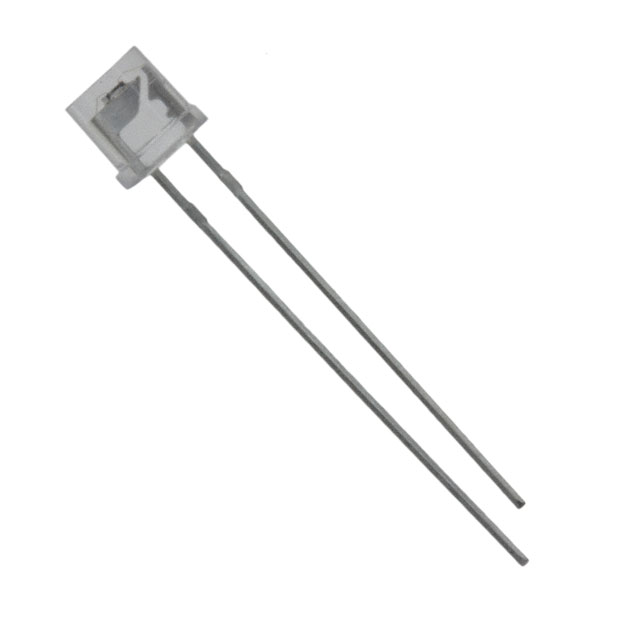

# Building a videojitter instrument on the cheap

As explained [in the README][], videojitter requires an _instrument_ to record
the physical light output of the display you are trying to measure.

You may already have hardware to do this, especially if you have access to a
lab. Basically, if you have a way to capture the output of a [sufficiently
fast][requirements] light sensor into a WAV file, you're already good to go and
the rest of this document should be of no interest to you.

If, however, you are missing this crucial piece of equipment and are looking for
a solution, do read on…

## Building a dirt-cheap instrument in minutes

You can build an instrument by putting together the following parts:

- A suitable light sensor from an electronics store;
- The microphone input jack of an audio interface (e.g. on a computer or a USB
  audio interface);
- Some wires/adapter to make the sensor fit into the audio jack.

That's it. Really - it's as simple as that. You can get easily get away with
spending less than $30 on the above. In fact, if you already have a suitable
microphone input (which is quite possible), you can probably get away with
spending less than half that.

As for tools, depending on the adapter you use, you may only need a
screwdriver - no soldering required.

## Hold on, how could that possibly work?

The output of a light sensor is an analog signal which can be measured by any
suitable [ADC][]. A microphone audio input is such an ADC, and its
characteristics (sample rate and bit depth) are perfectly appropriate (overkill,
even) for our needs. Conceptually, an audio input is really just a specialized
oscilloscope… and the resulting signal can easily be saved into a WAV file for
videojitter to consume.

The other missing piece is a power supply, as most light sensors require some
current to flow through them to operate. But here's the really neat part: a
microphone input jack [is also a power supply][]! Indeed, some types of
microphones require a DC voltage to operate; for this reason, most microphone
inputs make a small amount of DC current available on the input pins, and that
is enough to power a light sensor.

So: we can use the microphone input to power the light sensor _and_ read its
output at the same time. We don't need anything else!

## What about accuracy/performance?

The quality of the instrument mostly comes down to the [speed of the light
sensor used][requirements] and not much else.

To give an idea, videojitter was developed and tested using a [Panasonic AMS3][]
which cost the author ~$2 (not a typo) in 2014. Its 10%-90% response time is
rated at 8.5 milliseconds which is perfectly adequate for measurements up to 120
FPS. In the right conditions, that $2 piece of kit has been observed to produce
extremely clean measurements with transition time variance measured in
double-digit *micro*seconds (again, not a typo).

## Okay I'm sold, what do I need to do?

### Step 1: acquire a suitable microphone input

You probably already have one. Most should work in theory, although it may be a
bit hit-and-miss in practice as these devices are obviously not designed for
this use case. An an example, videojitter was developed and tested using the
ASUS Xonar U3 shown in the pictures.

If in doubt you can use a voltmeter on the microphone jack to check for the
presence of DC voltage. Typically it's between 1-4 volts.

**Note:** audio inputs marked as _line_ inputs are unlikely to work as these
don't usually provide a DC voltage - you want an input specifically labelled as
a microphone input.

If you don't have a suitable microphone input, look for an audio interface that
provides one. You can usually just search for something like "USB audio" on
Amazon and pick the cheapest result you can find. Even dirt-cheap, no-name
garbage devices should work just fine and their specs will still be overkill for
videojitter. USB interfaces as cheap as $10 have been shown to work.

### Step 2: acquire a suitable light sensor

When it comes to light sensors, electronics shops such as [Conrad][] and
[Mouser][] should provide plenty of options.

Make sure the light sensor supply voltage range is compatible with the DC
voltage supplied by the microphone input you want to use it with. Typically
you'd want a light sensor that can work with a ~3 V supply or whereabouts.

If you have multiple sensors to choose from, pick the fastest one. The spec
sheet should tell you how fast the sensor is. For example:

### Step 3: connect the light sensor to the microphone input receptacle

Some types of light sensors are polarized, meaning the two leads are not
interchangeable. In that case the sensor needs to be plugged in the right way
around. This will be mentioned in the light sensor spec sheet. If the light
sensor is non-polarized, it doesn't matter which way you plug it in.

The way you connect the light sensor to the audio jack depends on which type of
[jack][] you have:

- **TS mono microphone jack**: connect the anode (-) to the sleeve and the
  cathode (+) to the tip.
- **TRS stereo microphone jack:** connect the anode (-) to the sleeve and the
  cathode (+) to the tip (left channel) or ring (right channel).
- **TRRS combined headphone and microphone jack:** [varies][]

The most straightforward way to make the connection is to use an audio jack to
[screw terminal block][] adapter, which can be obtained for a few bucks on e.g.
Amazon:

This will allow you to easily make and undo the connections as desired with
nothing else than a screwdriver - no soldering required.

Of course, you can also go for a cleaner, more permanent solution using a
properly soldered jack plug if you so desire.

### Step 4: testing

After putting all the pieces together, you can use any audio recording software
to capture the light signal on the microphone input and save it as a WAV file
for videojitter to consume.

It's best to use software that allows you to visualize the waveform so that you
can check that everything is working properly. [Audacity][] is free and
perfectly adequate for this purpose.

**Note:** if you have a stereo microphone input, you might have to record in
stereo for the light signal to be captured, as otherwise the wrong channel may
be used.

For a quick sanity check, start a recording and then turn the lights on/off a
few times - you should be able to observe your movements on the waveform, for
example:

That's it! You now have an instrument that can be used to make videojitter
measurements. Read the [instructions][] to find out how.

[ADC]: https://en.wikipedia.org/wiki/Analog-to-digital_converter
[Audacity]: https://www.audacityteam.org/
[is also a power supply]:
  https://en.wikipedia.org/wiki/Phone_connector_(audio)#/media/File:Jackplug-wiring.svg
[jack]: https://en.wikipedia.org/wiki/Phone_connector_(audio)
[Conrad]: https://www.conrad.com/
[Mouser]: https://www.mouser.co.uk/
[in the README]: README.md#getting-an-instrument
[instructions]: README.md#how-do-i-use-it
[Panasonic AMS3]:
  https://industrial.panasonic.com/cdbs/www-data/pdf/ADD8000/ADD8000C6.pdf
[requirements]: README.md#requirements-on-the-instrument
[screw terminal block]: https://en.wikipedia.org/wiki/Screw_terminal_block
[varies]: https://en.wikipedia.org/wiki/Phone_connector_(audio)#TRRS_standards
