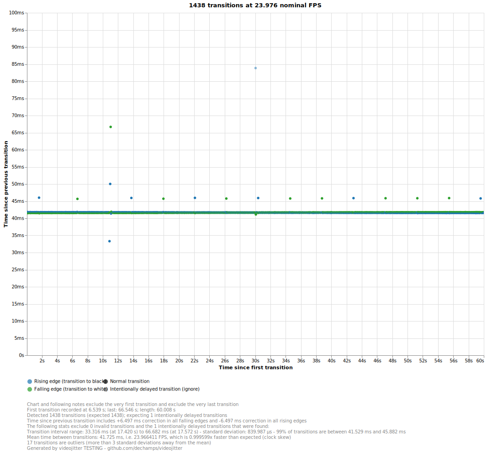
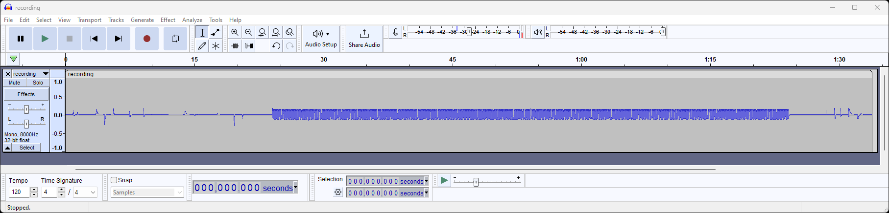
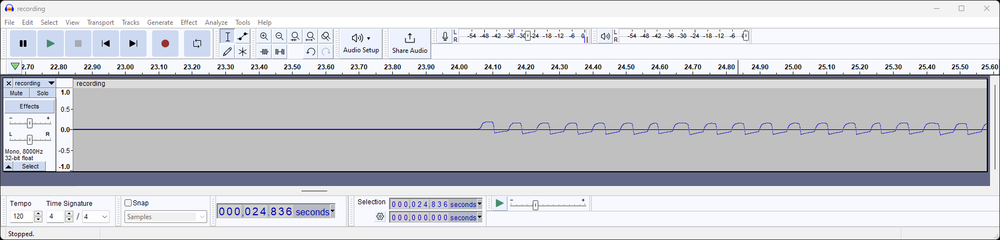

# videojitter - the video cadence measurement toolbox

_"You don't have to trust your eyes anymore"_



[(more examples)][examples]

_Brought to you by [Etienne Dechamps][] - [GitHub][]_

## What is it?

videojitter is a tool for **accurate measurement of frame presentation timing in
a video playback system**. It can be used to detect and quantify issues such as:

- **Frames being displayed too early or too late**
- **Dropped frames**
- **Repeated frames**
- **Periodic patterns** such as 3:2 "24p@60Hz"
- **Sudden changes** in presentation cadence
- Video **clock jitter**
- Video **clock skew**
- etc.

Contrary to purely software-based solutions, videojitter relies on a **hardware
instrument** to **physically measure the light output of the display**. This
means that **it is not limited to software video players** and can measure the
output of _any_ video player, even dedicated hardware players (Smart TVs,
set-top boxes, smartphones, etc.), as long as they can play the test video files
videojitter provides.

videojitter treats the entire video playback chain as a black box. Contrary to
"white box" approaches (e.g. GPU statistics), **the playback system cannot lie**
in videojitter measurements - videojitter measures the same light that reaches
your eyeballs.

## Who is it for?

- Video enthusiasts looking to verify and improve their playback systems
- Video player developers
- Reviewers and researchers

This tool is expected to be particularly useful to people who use or develop
software video players running on PCs, as frame presentation cadence can be
especially tricky to get right on such setups.

## How does it work?

videojitter takes the form of a collection of Python command line applications
for setting up a test, processing recorded measurement data, and displaying the
results as a nice readable chart for human consumption (or as CSV for further
processing).

The basic workflow is:

1. videojitter generates a test video file for the measurement;
2. A light sensor (the _instrument_) is pointed towards the display of the video
   playback system under test;
3. The system under test is made to play the test video while the signal from
   the instrument is being recorded into a WAV file;
4. videojitter analyzes the resulting WAV file to estimate frame transition
   times;
5. videojitter generates a chart or CSV from the results.

## How do I use it?

### Prerequisites

You will need:

- A computer (any OS will do) to run videojitter itself;
- The video playback system you want to measure must be capable of playing
  arbitrary video files;
- Reasonably dark lighting conditions so that videojitter can tell the light
  from the display apart from ambient light;
- And, most importantly, an _instrument_. More on that below.

#### Getting an instrument

videojitter works by analyzing the recorded light levels emitted from a display.
Measuring light levels requires special hardware.

Basically, you need a measurement setup that can measure light intensity over
time and write the resulting signal to a WAV file for videojitter to consume. In
videojitter terminology, this light recording device is called the _instrument_.

If you have access to a lab, you may already have hardware to do this - for
example, you may already have a suitable light sensor, a power supply, and an
oscilloscope that can export WAV files. In that case, great! You're good to go.

Otherwise, you will need to obtain the hardware or build it yourself. But don't
let that scare you! Building your own instrument is much simpler than you may
think: a basic instrument can be built using only a few dollars worth of parts
that can be assembled in minutes. Read [this guide][] to find out how.

#### Requirements on the instrument

The most important performance metric for the instrument is its _speed_, i.e.
how quickly it reacts to changes in light level.

As a rule of thumb, for good results, the instrument should be at least as fast
as the minimum frame duration you are looking to measure. So, for example, the
[Panasonic AMS3][] light sensor is documented as taking 8.5 ms (measured between
10% and 90% response) to respond to a step change in light level. This means
that sensor will start to show its limits around 120 frames per second or so. It
is perfectly adequate for measuring typical 24 FPS video.

Even if the instrument is too slow, videojitter will likely still be able to
provide somewhat usable results - typically the only real problem is a loss of
precision which gets worse around sudden frame duration changes. Note that such
measurement artifacts can also be caused by the display itself being too slow to
refresh - they are not necessarily the instrument's fault.

Other properties of the instrument include sampling rate and signal to noise
ratio (SNR). These are usually not the bottleneck as even dirt-cheap instruments
typically have tons of margin there.

### Step 1: install videojitter

1. Make sure you have [Python][] installed.
   - On Windows, you can get it from the Microsoft Store, or just run
     `winget install python`.
2. Make sure you have [FFmpeg][] installed.
   - On Windows, you can install it by running `winget install ffmpeg`.
   - You don't need FFmpeg if you don't need to generate a test video, e.g. you
     already have some at hand or you're only looking to analyze pre-existing
     recordings.
3. Make sure you have [pipx][] installed.
4. Run:

   ```shell
   pipx install videojitter
   ```

5. That's it! videojitter commands should now be available.

Run `pipx upgrade videojitter` to update to new versions as they become
available.

### Step 2: generate a spec

First, you need to generate a metadata file which records information about the
measurement you are trying to make for other videojitter tools to consume. This
is called a spec file and is produced with the following command:

```shell
videojitter-generate-spec --output-spec-file spec.json
```

This is also where you can configure the duration and the frame rate of the test
video you intend to use. By default, videojitter assumes a 23.976 FPS video
running for 1 minute. Run `videojitter-generate-spec --help` to learn how to
change these parameters.

### Step 3: generate a test video

The following command will generate the video that is meant to be played on the
system under test:

```shell
videojitter-generate-video --spec-file spec.json --output-file video.mp4
```

Some aspects of the video (e.g. resolution) can be configured directly; run
`videojitter-generate-video --help` to learn more. FFmpeg is capable of
producing videos in a very vast array of codecs and formats, but most of these
options are not exposed through videojitter due to the sheer number of them; if
you want to change these, you will need to [adjust the code][], or feel free to
[file a feature request][] if you believe the option would be generally useful.

### Step 4: start recording

Make the room reasonably dark so that the instrument can easily tell the light
from the display apart from ambient light.

Connect your instrument and point it towards the display of the video playback
system under test. It is best to place the instrument some distance away from
the display so that the blinking squares of the warmup/cooldown pattern (more on
that later) can be distinguished from the actual test signal.

Set up your instrument and hit the start button in whatever software you are
using to record the data (e.g. Audacity). There is no need to precisely
synchronize the start of the recording with the beginning of playback.

### Step 5: start playback

It's usually best to make sure the display under test is running at 100%
brightness to maximize the signal to noise ratio. This matters especially in the
case of displays that use a PWM backlight, as PWM flicker makes the analyzer's
job harder.

Play the test video that you generated in step 3 on the playback system under
test and wait for it to end.

You will notice that the test video is divided into 3 sections:

1. The first section is called "warmup" and displays an alternating checker
   pattern for 5 seconds (assuming default settings).
2. The second section is the test signal itself, and alternates between full
   screen black and full screen white on every frame.
   - If you look closely you might also notice a single repeated frame exactly
     halfway through the video. This repeated frame is called an _intentionally
     delayed transition_; it is part of the test video and provides a marker for
     the analyzer. For more information about the intententionally delayed
     transition, see [this FAQ][intentionally-delayed-transition-faq].
3. The third section is called "cooldown" and is the same as "warmup".

The warmup and cooldown sections don't have to run for their full durations and
are not considered part of the test signal. For more information on warmup and
cooldown, see [this FAQ][warmup-cooldown-faq].

Make sure that the instrument is far enough away from the display that it can
"see" many squares of the warmup/cooldown checker pattern. Otherwise videojitter
might mistake the pattern for the test signal itself.

### Step 6: stop recording

Once the test video has been played until the end, stop the recording.

There is no need to precisely synchronize the end of the recording with the end
of playback, nor is there any need to trim the recording afterwards: videojitter
is smart enough to automatically detect the boundaries of the test signal by
itself.

Now would be a good time to visually inspect the recorded waveform as a quick
sanity check. If your recording software doesn't allow you to inspect the
waveform, you can use [Audacity][].

In particular you'd want to check that the test signal is actually present - it
should be visually obvious from the waveform where the test signal begins and
ends. In this example the test signal starts at around 25 seconds into the
recording and ends 60 seconds later:



Zooming into the start of the test signal - the periodicity induced by the 12
"blinks" per second from the 24 FPS test video is clearly visible:



You should also look for signs of clipping, i.e. too much light overloading the
sensor and/or the ADC. Clipping can sometimes be remediated by re-recording with
a lower gain/volume or by moving the light sensor further away from the display.
videojitter will often still be able to produce sensible results even with a
clipped signal, though.

Save the recording into a WAV file. Make sure the WAV file is mono - if you have
more than one channel, remove all other channels before saving (in Audacity,
click on the track label, then _Split Stereo to Mono_, then remove the channel
you don't need).

### Step 7: analyze the recording

Feed the recording WAV file to the videojitter analyzer:

```shell
videojitter-analyze-recording --spec-file spec.json --recording-file recording.wav --output-edges-csv-file edges.csv
```

Pay close attention to the text output of the analyzer. The analyzer will print
warning messages if it believes there is a problem with the recording or if it
gets confused.

Assuming all went well, you should end up with a `edges.csv` file that contains
the estimated timestamp of every edge (basically, a frame transition) that the
analyzer was able to extract from the recording.

### Step 8: generate the report

Finally, you can now use the analyzer output to generate a summary report in the
form of a graphical chart:

```shell
videojitter-generate-report --spec-file spec.json --edges-csv-file edges.csv --output-chart-file report.html
```

Pay close attention to the text output of the report generator. The generator
will print warning messages if it believes there is a problem with the analysis.

You should end up with a `report.html` file which you can open in your web
browser of choice.

Note the resulting chart is interactive - you can zoom in on the X axis using
the mouse wheel, and tooltips appear when you hover the mouse over individual
data points. The "…" menu in the top right corner of the chart can be used to
save the chart in various image formats for easy sharing.

You can also save the results as CSV for further analysis using the
`--output-csv-file` option.

### Step 9: wrapping up

Congratulations, you just made your first videojitter measurement!

For some hints on how to interpret typical results, take a look at the [examples
gallery][examples].

To make more measurements, just repeat the steps as necessary. You don't need to
regenerate a spec nor a test video if their parameters haven't changed.

If you ran into issues, or would like to request additional features, or for any
other feedback, do not hesitate to [file an issue][] or [participate in
discussions][].

## Developer documentation

See [`src/README`][].

[adjust the code]: src/
[Audacity]: https://www.audacityteam.org/
[Etienne Dechamps]: mailto:etienne@edechamps.fr
[examples]: EXAMPLES.md
[file a feature request]: https://github.com/dechamps/videojitter/issues
[file an issue]: https://github.com/dechamps/videojitter/issues
[participate in discussions]:
  https://github.com/dechamps/videojitter/discussions
[FFmpeg]: https://ffmpeg.org/
[GitHub]: https://github.com/dechamps/videojitter
[intentionally-delayed-transition-faq]:
  FAQ.md#what-is-the-purpose-of-the-intentionally-delayed-transition
[`src/README`]: src/README.md
[Panasonic AMS3]:
  https://industrial.panasonic.com/cdbs/www-data/pdf/ADD8000/ADD8000C6.pdf
[pipx]: https://pypa.github.io/pipx/
[Python]: https://www.python.org/
[this guide]: INSTRUMENT.md
[warmup-cooldown-faq]:
  FAQ.md#what-is-the-purpose-of-the-warmup-and-cooldown-patterns
